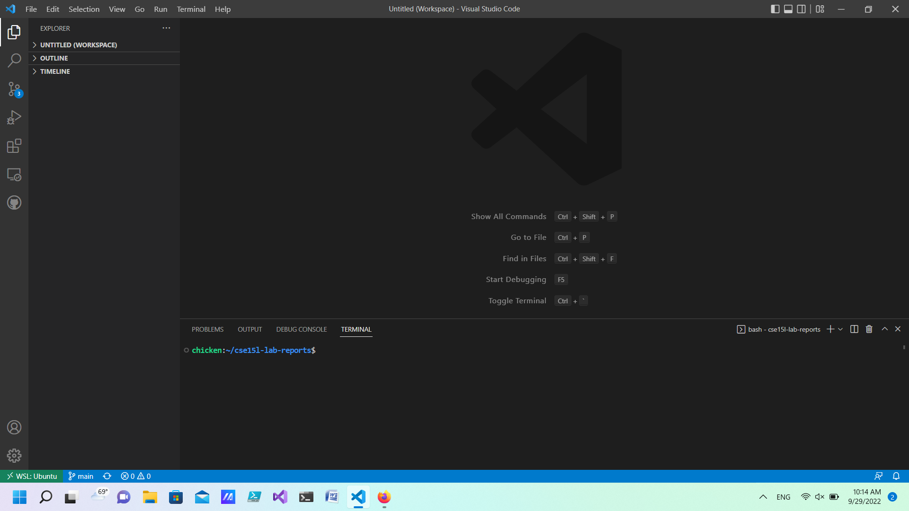

# Lab Report 1 (Week 1)
This lab will act as a tutorial for setting up the work environment necessary to do assignments in CSE 15L. It is
based on the Lab for Week 1 by Professor Joe Politz.

[https://ucsd-cse15l-f22.github.io/week/week1/](https://ucsd-cse15l-f22.github.io/week/week1/)

In short, by the end of this tutorial you will: have Visual Studio Code set up, and be able to access the remote ieng6 server from your workstation using SSH. In addition,
you will also know some tricks to make working on a remote server with ssh a bit more convenient.

## Installing VSCode
In this secion, we will go over how to install and set up Visual Studio Code - an IDE for editing and running code.
This can be different depending on your Operating System, and other system specifications, but the download
and instructions can be found on the website:

[https://code.visualstudio.com/](https://code.visualstudio.com/)

A successful set up should look like this.



Now that we have a student account, and an IDE to write code on, let's access the ieng6 server and start coding!

## Remotely Connecting
In this section, we will go over how to set up SSH and use it to remote into the UCSD ieng6 server using our student account.
Like the set up for Visual Studio Code, the process for setting up SSH will depend on the Operating System and configurations 
on your workstation. For computers using a Windows OS, you can download openSSH to remote into servers. 

[OpenSSH](https://docs.microsoft.com/en-us/windows-server/administration/openssh/openssh_install_firstuse)

For mac OS and Linux systems, ssh should already be installed and can be accessed on the terminal. 
For convenience, we will be accessing the terminal through VSCode. 

The syntax for using ssh is: 

`ssh <username>@<server>`

So for this lab we will be accessing the ieng6 server by doing: 

`ssh <username>@ieng6.ucsd.edu`

When you first connect to a remote server, it will give you a warning. Without going into too much technical detail,
this warning happens because the server has not been verified by our computer yet. SSH is letting you know that we
do not know this server, and cannot ensure that it is safe. By typing yes, you will add the server to known servers
and so SSH will no longer warn you.


Now we have access to the ieng6 server, and so we can run some programs and play around using the server.

## Trying Some Commands
In this section, we will run some commands and get used to working on the remote server. Some useful
commands we will introduce are: 

```
cd <directory_name>
ls <director_name>
pwd
mkdir <directory_name>
cp <source_path> <destination_path>
```

`cd`
This command lets you change directory. If you want to access the home directory you can type `cd ~`

`ls`
This command lists all files in the specified directory. For example if you want to list files in the current directory 
you would type: `ls`

`pwd`
This command prints the working directory. This will output the full path to the current directory you are on.

`mkdir`
This command makes a directory at the specified location with the specified name. For example to create a "test" directory
at the current location you would type: `mkdir test`

`cp`
This command copies a file from one location to the other location. For example if you have a file named "file1.txt" and wish to copy
it to the test directory we made under the name "file2.txt", we would type: `cp file1.txt test/file2.txt`

*To exit your connection to the remote server you type `exit`*


## Moving Files with `scp`
In this section, we will use `scp` to copy files to and from a remote server using ssh. This command works the same
as the command `cp`, except that it allows you to work with remote servers. 
Generally, there are two ways to use this command.
1. To copy from a remote server to your workstation

 `scp <username@servername>:<source_file> <destination_file>`

2. To copy from the workstation to a remote server

 `scp <source_file> <username@servername>:<destination_file>`

 

## Setting an SSH Key
Up until now, if we wanted to remote into a server we had to type in our password every single time. In this section, we will introduce a way to allow you to remote without using a password. Lucky for us SSH servers can verify our identity in more than one way. Up until now we have been using an username and password to connect, but there is another way! We can create a public-private key associated
with our computer and save the public key onto the server we want to remote to. This allows us to verify our identity using the 
key instead of a password. 
To set this up we will use the command: `ssh-keygen` 


## Optimizing Remote Running
We can make it even easier to work on remote servers with some neat little tricks. A couple introduced in this lab
are running commands and then quitting on a remote server. We can do this with: `ssh <username>@<server> "<command>"`
Another trick that applies to terminals in general is separating commands with a semi-colon to fit them all on one line.
An example is: `scp <username>@<server>:file.txt file.txt; cat file.txt`
This line copies a file from a remote server, saves it on our workstation, and then displays the contents of the file to our screen.


## View previous labs
[Lab Report 1](lab-report-1-week-0.md)
