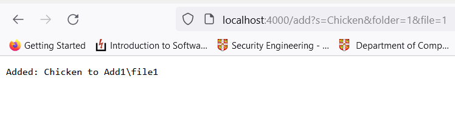
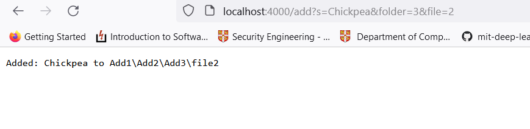
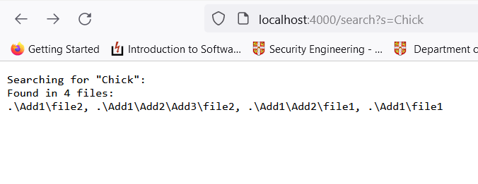
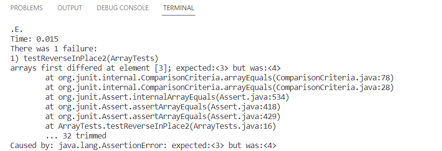
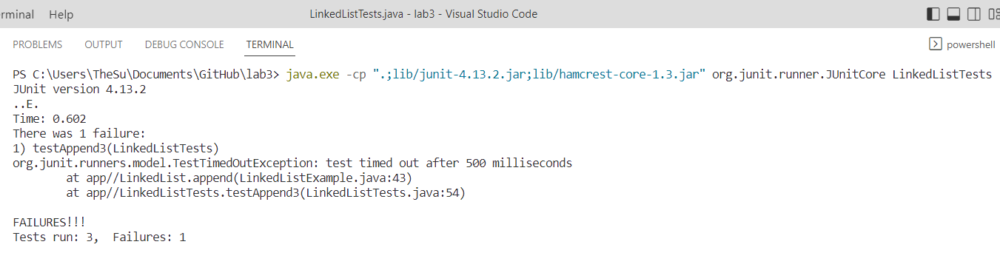

# Lab Report 2 (Week 3)
In the first part of this lab report we will describe some new updates to a simple search engine that was created. The second half of the lab report will explain some examples of unit testing code using JUnit.

## Search Engine
This simple implementation of a search engine allows users to search for the presence of a keyword in a file system. The search engine will recursively search through every file in the system and return the paths to all the files that contain the keyword. The following screenshots will provide a more concrete example of how this search engine works.

Here is the code behind this program:
```
class SearchEngine {
    public static void main(String[] args) throws IOException {
        if(args.length == 0){
            System.out.println("Missing port number! Try any number between 1024 to 49151");
            return;
        }

        int port = Integer.parseInt(args[0]);
        Server.start(port, new Handler());
    }
}
```
The code above turns the local machine that the program on into a server that is listening on the given port. We pass a Handler that processes all requests and calls made on the server.

The code for the Handler looks as such:
```
public String handleRequest(URI url) {
    String output = ""; // output string
    // Handle call to root
    if (url.getPath().equals("/")) {
        return syntax;
    } 
    // Handle call to add
    else if (url.getPath().contains("add")) {
        String[] parameters = url.getQuery().split(");  // get all queries
        String key = "";
        String folder = "";
        String file = "";
        if(parameters.length != 3){
          return syntax;
        }
        if(parameters[0].charAt(0) == 's'){
          key = parameters[0].substring(parameters[0indexOf("=") + 1);
        } else{
          return syntax;
        }
        String call = parameters[1].substring(0parameters[1].indexOf("="));
        String param = parameters[1].substring(paramete[1].indexOf("=") + 1);
        if(call.equals("folder")){
          switch(param.charAt(0)){
            case '1':
              folder = "Add1";
              break;
            case '2':
              folder = "Add1/Add2";
              break;
            case '3':
              folder = "Add1/Add2/Add3";
              break;
            default:
              return syntax;
          }
        }
        call = parameters[2].substring(0, parameters[2indexOf("="));
        param = parameters[2].substring(parameters[2indexOf("=") + 1);
        if(call.equals("file")){
          if(param.charAt(0) < '1' || param.charAt(0) '2'){
            return syntax;
          }
          file = "file" + param;
        } else{
          return syntax;
        }
        File out = new File(folder + "/" + file);
        try{
          Files.write(out.toPath(), key.getBytes());
        } catch(Exception e){
          return String.format("Error: %s", e.getMessa());
        }
        output = String.format("Added: %s to %s\n\n"key, out.getPath());
    } 
    // Handle call to search 
    else if(url.getPath().contains("search")){
        String[] parameters = url.getQuery().spl("=");  // get all queries
          if(parameters[0].equals("s")){
            output = String.format("Searching fo\"%s\":\n", parameters[1]);
            ArrayList<String> results = new ArrayList();
            getFiles(new File("."), results, paramete[1]);
            output += String.format("Found in %files:\n", results.size());
            for(String s : results){
              output += s + ", ";
            }
            output = output.substring(0, output.length(- 2);
          }
    }
    // Invalid url
    else{
        System.out.println("Path: " + url.getPath());
        output = "404 Not Found!";
    }
    return output;
}
```
The handleRequest function is at the heart of the program. It processes the requests sent to the server, and determines what it is making a call to. If the request is calling add, then the query parameter is added to a specific file in a specified folder. If the request calls search, then the handler will recursively search through all the files and subfiles found in the server and return the paths of all the files that contain the keyword. Finally, all other requests are not recognized and either an error message, or help documentation is returned.

```
private static void getFiles(File start, ArrayList<String> out, String target) {
  if(!start.exists()){
    System.out.println("File: " + start.getPath() + does not exist");
  }
  if(start.isDirectory()){
    File[] paths = start.listFiles();
    for(File subFile: paths){
      File test = new File(subFile.getPath());
      getFiles(test, out, target);
    }
  }
  else{
    try(Scanner reader = new Scanner(start);){
      while(reader.hasNextLine()){
        if(reader.nextLine().contains(target)){
          out.add(start.getPath());
          break;
        }
      }
    } catch(Exception e){
      System.out.println("Error: " + e.getMessage());
    } 
  }
}
```
The getFiles function is another helper function. This is the function that recursively searches through every file and folder to find the target words.

### Examples
Here are some example requests to the server, and the corresponding output.
### Add

This example shows the result of calling add. This will add the word Chicken to the file at add1/file1.

This example shows another result of calling add. In this case we add the word Chickpea to the file at add1/add2/add3/file2.
Some other calls were made to add to populate other files and subfiles, but these are not shown since they returned similar results.

### Search


This example shows the results of calling search. This will return the path to all the files that contained the target keyword - in this case "Chick". An array list of all these paths are updated.

## Unit Testing with JUnit
In this section we will go over some simple examples of testing code to look for symptoms and bugs.

### Example 1
In this example we have a function that simply reverses the elements in an array. The code for this function is shown below. 

```
static void reverseInPlace(int[] arr) {
  for(int i = 0; i < arr.length; i += 1) {
    arr[i] = arr[arr.length - i - 1];
  }
}
```
We run the following test to check if the function does indeed return the array reversed. Specifically, for the input {1, 2, 3, 4, 5, 6} we expect the output to be: {6, 5, 4, 3, 2, 1}.
```
@Test 
public void testReverseInPlace2() {
   int[] input1 = { 1, 2, 3, 4, 5, 6 };
   ArrayExamples.reverseInPlace(input1);
   assertArrayEquals(new int[]{ 6, 5, 4, 3, 2, 1 }, input1);
}
```
We see below the result of running the test.


As you can see, the test has failed. The output of our JUnit test tells us that the third element is a 4 instead of a 3.
If you go through the code one more time, you will be able to see why this error occurs - because each element in the second half of the array is being overwritten, we cannot replace the first half of the array with the correct values.
There are many possible ways to fix this bug. The following is one solution.
```
for(int i = 0; i < arr.length; i += 1) {
  arr[i] += arr[arr.length - i - 1];
  arr[arr.length - i - 1] = arr[i] - arr[arr.length - i - 1];
  arr[i] = arr[arr.length - i - 1] - arr[i];
}
```

### Example 2
In this example we have a method that is part of a larger program which implements a Linked List data structure. This specific method should append data values to the end of the list.
```
public void append(int value) {
    if(this.root == null) {
        this.root = new Node(value, null);
        return;
    }
    // If it's just one element, add if after that one
    Node n = this.root;
    if(n.next == null) {
        n.next = new Node(value, null);
        return;
    }
    // Otherwise, loop until the end and add at the end with a null
    while(n.next != null) {
        n = n.next;
        n.next = new Node(value, null);
    }
}
```

To test this code, we run the following test. We append the values 0 to 3 and then check to make sure that the list has the correct values in the correct order. 
```
@Test(timeout = 500)
    public void testAppend3() {
        LinkedList tester = new LinkedList();
        tester.append(0);
        tester.append(1);
        tester.append(2);
        tester.append(3);
        assertEquals(0, tester.root.value);
        assertEquals(1, tester.root.next.value);
        assertEquals(2, tester.root.next.next.value);
        assertEquals(3, tester.root.next.next.next.value);
    }
```
The results of this test are shown below.


As you can see, the test failed because the unit test has timed out before it could finish running. Although there are multiple reasons that could cause this symptom, we suspect this to be caused by an infinite loop. We suspect an infinite loop because if there are more than 2 values in the Linked List, the code will enter a while loop. In each iteration of the while loop `n.next` is being initialized with a node, and so the sentinel will never be met.

A fix for this bug is suggested below:
```
while(n.next != null) {
  n = n.next;
}
n.next = new Node(value, null);
```

## View previous labs
[Lab Report 1](./lab-report-1-week-0.md)

[Lab Report 1.5](./lab-report-1-week-1.md)
