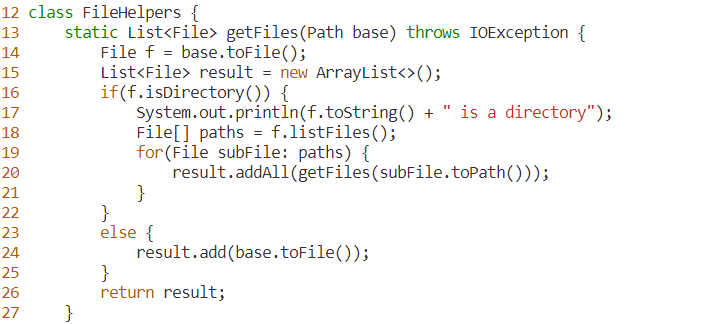

# Lab Report 4 (Week 7)
In this lab report you will be introduced to Vim and some simple commands.

## Part 1 - What is Vim?
Vim is a tool that allows users to edit files from the command line. Part of the appeal of Vim is that it allows for some pretty neat tricks that make editing easier. For example, let's say you want to replace a word with something else. In this particular example, we have a function called getFiles:
```
static List<File> getFiles(Path start) throws IOException {
  File f = start.toFile();
  List<File> result = new ArrayList<>();
  if(f.isDirectory()) {
    System.out.println(f.toString() + " is a directory");
    File[] paths = f.listFiles();
    for(File subFile: paths) {
      result.addAll(getFiles(subFile.toPath()));
    }
  }
  else {
    result.add(start.toFile());
  }
  return result;
}
```

Let's say we want to replace all uses of the parameter start with base. We can do this in Vim in just 18 characters by using this command:

`:%s/start/base<Enter>:w<Enter>`

Here is what it looks like to run the commands


This is what it looks like after the command has been run.


Finally, to save the changes we type :w<Enter>. This will write to the file we are editing.


## Part 2 - Working on Remote Machiens
Developers often find themselves working on remote machines. There are many reasons why this is the case. For example, we may want to access resources on a server which we do not have direct physical access to. To learn more about how to do this, read [Lab Report 1](lab-report-1-week-0.md). Now, let's say we want to edit files and run them on a remote server. Now that we know how to use Vim, we can test how long it would take to edit and run files on a remote server using Vim, as opposed to using a code editor like VSCode to edit the file locally and copy it to the remote server. Here are my results:

`Using Vim:    13.35 seconds`

`Using VSCode: 20.81 seconds`

As you can see, editing files directly in the remote server using Vim takes much less time. The main difficulty during my tests was having to switch between the terminal and VSCode and then having to wait for the file to copy with scp before waiting for an ssh connection to run the file remotely. On the other hand, using Vim was easy and only required working on one terminal without having to switch between machines. For remote work, it seems like Vim would be a very convenient tool in many cases. However, for some projects, such as ones that require a GUI or other graphics, it might make more sense to use a local code editor to make changes before copying the files to a remote server to run. Also, having syntax checking and linters in code editors can also be a very useful tool which is difficult to have on vim. All in all, Vim is a powerful tool that can make tasks more convenient if used in the right situations.

## View previous labs

[Lab Report 1](./lab-report-1-week-0.md)

[Lab Report 1.5](./lab-report-1-week-1.md)

[Lab Report 2](./lab-report-2-week-3.md)

[Lab Report 3](./lab-report-3-week-5.md)