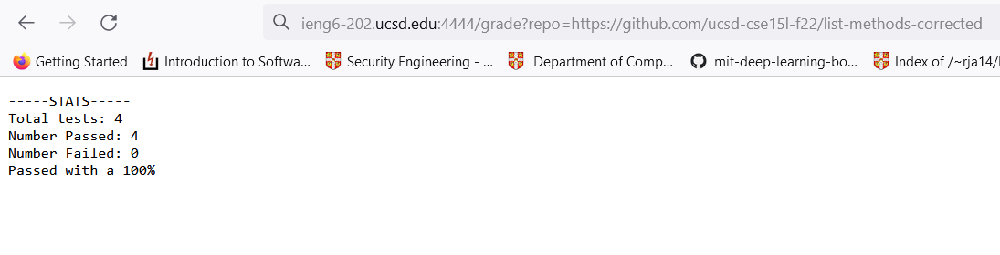
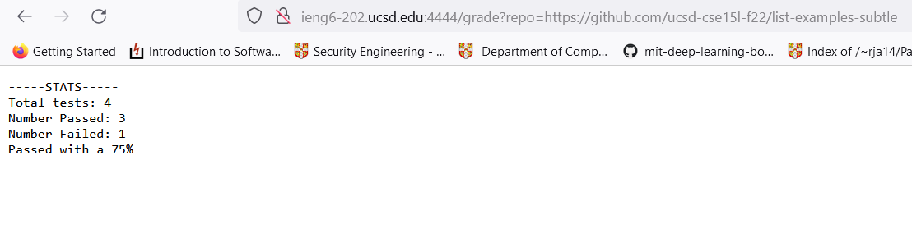
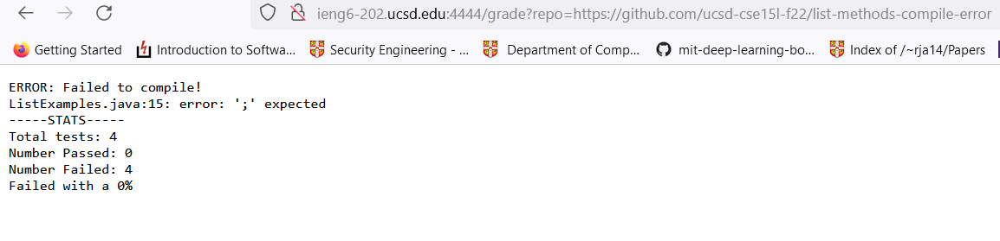

# Lab Report 5 (Week 9)
In this lab report you will be introduced to writing a shell script for bash that autogrades code from a github repository.

## Part 1 - Shell Scripts and Bash
One of the cool things about shells like bash, is that they often allow you to write scripts. There are many tasks that these scripts can do, say for example, autograding code taken from a github repository.
```
# path to JUNIT
CLASSPATH=".:lib/hamcrest-core-1.3.jar:lib/junit-4.13.2.jar"
# junit tester module
JUNIT="org.junit.runner.JUnitCore"
# file to compile
FILE="ListExamples.java"
# Count passed tests
PASSED=0
FAILED=0
TOTAL=4

# make sure we don't have reclone conflict
rm ListExamples.java &> /dev/null
rm -rf student-submission &> /dev/null
# clone student-submission for testing
git clone $1 student-submission 2> errorlog.txt > gitlog.txt

# make sure that file exists
if [ ! -f student-submission/$FILE ]; then
  echo "ERROR: Missing $FILE";
  exit 1
fi
# get cloned ListExamples file
cp student-submission/ListExamples.java ./

# compile java files
javac -cp $CLASSPATH *.java 2> compileErrLog.txt # > javaclog.txt
if [[ $? -ne 0 ]]; then
    MSG=$(grep "error:" compileErrLog.txt)
    echo "ERROR: Failed to compile!"
    echo $MSG
else
    # run tests
    java -cp $CLASSPATH $JUNIT TestListExamples 2> javaErrlog.txt > javalog.txt 
    # check test output status
    ALLPASS=$(cat javalog.txt | grep "OK")
    if [[ $ALLPASS == *"OK"* ]]; then
      PASSED=4
    else
      FAIL=$(cat javalog.txt | grep "Failures")
      PASSED=$(($TOTAL - ${FAIL: -1}))
    fi
fi

# Print stats
FAILED=$((TOTAL - PASSED))
GRADE=$((($PASSED*100/$TOTAL)))
echo "-----STATS-----"
echo "Total tests: $TOTAL"
echo "Number Passed: $PASSED"
echo "Number Failed: $FAILED"
if (( $GRADE > 50 )); then
  echo "Passed with a $GRADE%"
else
  echo "Failed with a $GRADE%"
fi
```

This script clones a repository given as an argument, and compiles and tests the ListExamples.java file in the repository. It checks that the file exists, then checks that it can be compiled, and finally runs a separate testing file we have created. Here are some sample outputs below:





## Part 2 - Trace
Let's do a line by line trace of our grading script to see exactly what it does. If we take a look at our second sample output, we see that it passed all but 1 test. Let's see why:
The script starts with declaring some variables used throughout the program.
```
# path to JUNIT
CLASSPATH=".:lib/hamcrest-core-1.3.jar:lib/junit-4.13.2.jar"
# junit tester module
JUNIT="org.junit.runner.JUnitCore"
# file to compile
FILE="ListExamples.java"
# Count passed tests
PASSED=0
TOTAL=4
```

The CLASSPATH variable has all the paths to the files used for testing. The JUNIT variable has the testing module that we need. The FILE variable is the student submission we would like to test, and finally PASSED and TOTAL indicate the number of tests passed and the total tests executed. These variables help us keep the script clean and easier to read. 

The next part of our script clones the repository to get the student's submission.
```
# make sure we don't have reclone conflict
rm ListExamples.java &> /dev/null
rm -rf student-submission &> /dev/null
# clone student-submission for testing
git clone $1 student-submission 2> errorlog.txt > gitlog.txt
```
`rm ListExamples.java &> /dev/null` removes any existing ListExamples.java files from previous tests. We redirect all standard output and standard error into the /dev/null file which essentially just discards or ignores everything. This is done to prevent error messages such as the file does not exist, which is not strictly important to the purpose of our assignment. 

`rm -rf student-submission &> /dev/null` does something similar, and removes the student-submission directory from previous tests.  Again, all standard output and error is discarded.

Now that we can be certain that there are no files from previous tests, we can clone the new student repository for testing.
`git clone $1 student-submission 2> errorlog.txt > gitlog.txt` This line clones the given repository and saves into a directory named student-submission. All standard error is redirected to the errorlog.txt file, and all standard output is redirected to the gitlog.txt file.

Now that we have cloned the repository, we want to check that the file exists and is named ListExamples.java as expected. We do this with the following if statement.
```
# make sure that file exists
if [ ! -f student-submission/$FILE ]; then
  echo "ERROR: Missing $FILE";
  exit 1
fi
```

In this example, the student submission exists, and is properly named, so we do not enter the body of the if statement. Instead we move on.

Now that we know the file exists, we move it from the student-submission directory, into our testing directory that has all of our test files and modules.
`cp student-submission/ListExamples.java ./`

This command has no standard output or error, and has a return code of 0, to indicate a successful copy.

Now we actually compile the file.

```
javac -cp $CLASSPATH *.java 2> compileErrLog.txt > javaclog.txt
if [[ $? -ne 0 ]]; then
    MSG=$(grep "error:" compileErrLog.txt)
    echo "ERROR: Failed to compile!"
    echo $MSG
```

This command compiles all java files, including the test files and our student submission file. The standard output is saved into the javaclog.txt file, and standard error is stored into the compileErrLog.txt file. In this run, there are no compile time errors, nor output because all compilation is successful. If there was an error, the script would print that an compile error occurred, and also print the specific error message from the javac.

Now that our file has been compiled successfully, we wish to run tests on it.
```
if [[ $? -ne 0 ]]; then
    MSG=$(grep "error:" compileErrLog.txt)
    echo "ERROR: Failed to compile!"
    echo $MSG
else
    # run tests
    java -cp $CLASSPATH $JUNIT TestListExamples 2> javaErrlog.txt > javalog.txt
    # check test output status
    ALLPASS=$(cat javalog.txt | grep "OK")
    if [[ $ALLPASS == *"OK"* ]]; then
      PASSED=4
    else
      FAIL=$(cat javalog.txt | grep "Failures")
      PASSED=$(($TOTAL - ${FAIL: -1}))
    fi
fi
```

Since, there are no errors, we skip the if statement, and move onto the body of the else. 
`java -cp $CLASSPATH $JUNIT TestListExamples 2> javaErrlog.txt > javalog.txt` This command runs the java file with our tests, and stores all error output into javaErrLog.txt, and all standard otuput into javalog.txt. This would be the result of running the JUnit testing framework on our student submission. In this case we would not have any error, but we would have output saying that 1 test has failed. This command has a return value of 0, for no error.

`ALLPASS=$(cat javalog.txt | grep "OK")` This command checks if all tests have compiled successfully by looking for the OK output from JUnit. In this example, ALLPASS would be empty because we failed a test, and JUnit would not print OK.

```
if [[ $ALLPASS == *"OK"* ]]; then
  PASSED=4
else
  FAIL=$(cat javalog.txt | grep "Failures")
  PASSED=$(($TOTAL - ${FAIL: -1}))
fi
```

In this example, because ALLPASS does not equal OK, we skip the body of the if statement, and enter the body of the else. 

`FAILED=$(cat javalog.txt | grep "Failures")` This command gets the line with the number of tests failed from the JUnit output, and stores it in the FAIL variable.

`PASSED=$(($TOTAL - ${FAIL: -1}))` This command calculates how many tests were passed based off of the total tests set at the start of the script, and the number of tests failed as reported by JUnit. In this case, PASSED = 4 - 1 = 3.

Finally, we are ready to print the test statistics.
```
GRADE=$((($PASSED*100/$TOTAL)))
echo "-----STATS-----"
echo "Total tests: $TOTAL"
echo "Number Passed: $PASSED"
echo "Number Failed: $FAILED"
if (( $GRADE > 50 )); then
  echo "Passed with a $GRADE%"
else
  echo "Failed with a $GRADE%"
fi
```

`GRADE=$((($PASSED*100/$TOTAL)))` 
We first calculate the overall grade as a ratio between tests passed and the total number of tests. In this case, we get 300/4 = 75.

```
echo "-----STATS-----"
echo "Total tests: $TOTAL"
echo "Number Passed: $PASSED"
echo "Number Failed: $FAILED"
```
Next we print basic statistics, such as how many total tests there were, 4, passed tests, 3, and failed tests, 1.

Finally, we check if the student file passed or not, based off of the GRADE. If it passed more than half of the tests, it passed, otherwise the student submission failed.
```
if (( $GRADE > 50 )); then
  echo "Passed with a $GRADE%"
else
  echo "Failed with a $GRADE%"
fi
```

In this example, our grade is a 75, which is greater than 50, and so it has passed.

This concludes our script and we have successfully autograded a student submission.


## View previous labs

[Lab Report 1](./lab-report-1-week-0.md)

[Lab Report 1.5](./lab-report-1-week-1.md)

[Lab Report 2](./lab-report-2-week-3.md)

[Lab Report 3](./lab-report-3-week-5.md)

[Lab Report 4](./lab-report-4-week-7.md)